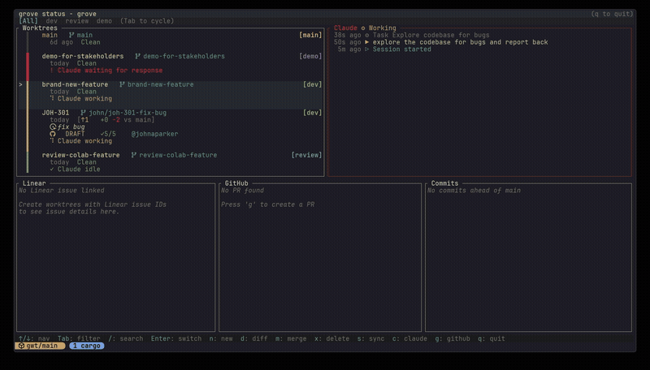

[](https://github.com/johnaparker/loom/actions/workflows/ci.yml)
[](https://github.com/johnaparker/loom/releases/latest)

# Loom

Loom is a TUI control center for managing git worktrees in tmux with Claude Code integration.
Monitor multiple Claude agents, optionally track Linear issues and GitHub PRs, all from a single dashboard.



If you work on multiple features simultaneously using git worktrees, `loom` gives you:

- **Claude agent monitoring** - See which agents are working, waiting for permission, or idle across all your worktrees
- **Worktree lifecycle** - Create, switch, merge, and remove worktrees without leaving the dashboard
- **Project context** - Link worktrees to Linear issues and GitHub PRs for at-a-glance status

The dashboard is the primary interface. CLI commands exist for quick one-off operations.

## Setup

Loom minimally requires:
- git
- tmux

### Installation

```bash
curl -fsSL https://github.com/johnaparker/loom/releases/latest/download/install.sh | bash
```

This installs loom to `~/.local/bin`. Add it to your PATH if not already:

```bash
export PATH="$HOME/.local/bin:$PATH"
```

### Building from source

```bash
cargo install --path .
```

### Claude Code Integration

Enable Claude agent tracking with:

```bash
loom config enable claude
```

This configures loom hooks in Claude's settings and enables state tracking (working/waiting/idle) per worktree. You'll be prompted about sandbox mode for new worktrees.

### GitHub Integration

Requires the [GitHub CLI](https://cli.github.com/). Enable with:

```bash
loom config enable github
```

This verifies `gh` is installed and authenticated, then enables PR status, check results, and review comments in the dashboard.

### Linear Integration

Enable with:

```bash
loom config enable linear
```

You'll be prompted for your API key (get from Linear → Settings → API) and shown available teams to select your issue prefix. You'll also be offered to install a Linear skill for Claude Code that teaches it how to work with your Linear issues. Loom then links worktrees to Linear issues automatically when branch names contain issue IDs (e.g., `user/lin-123-feature`).

### Configuration

loom uses a three-level config hierarchy: **global** → **project** → **worktree**. Each level can override the previous.

**Global config:** `~/.config/loom/config.toml`

```toml
# Root directory for all worktrees (default: ~/.worktrees)
worktree_root = "~/.worktrees"

# Worktree categories (max 4, default: ["dev"])
# When >2 categories, Tab cycles through filter in dashboard
categories = ["dev", "review", "demo"]

# Default category for new worktrees (used when -c not specified)
default_category = "dev"

# Cache directory for connector data (default: ~/.cache/loom)
cache_dir = "~/.cache/loom"

# Workflow mode: "push" (local-first) or "pull" (PR-based)
# - push: merge directly to main, new worktrees branch off main
# - pull: auto-fetch from origin, new worktrees branch off origin/main
workflow = "push"

[sync]
# Files/dirs to sync from main when creating worktrees
patterns = [".env", ".envrc", ".claude/"]

[claude]
# Enable Claude Code integration (default: true)
# When disabled, Claude state tracking is inactive
enabled = true

# Create new worktrees with Claude sandbox mode enabled
sandbox = true

# Auto-approve sandboxed bash commands (only applies when sandbox = true)
sandbox_auto_allow_bash = true

[linear]
# Enable Linear integration (default: false)
# When disabled, Linear panels are hidden and 'l' key is inactive
enabled = true

# Linear API key (get from Linear settings → API)
api_key = "lin_api_..."

# Team prefix for auto-detecting issues from branch names
# e.g., "LIN" matches branches like "john/lin-123-feature"
team_prefix = "LIN"

# Auto-update Linear issue status on loom new/merge
auto_update_status = true

[github]
# Enable GitHub integration (default: false)
# When disabled, GitHub panels are hidden and 'g' key is inactive
# Requires gh CLI to be installed and authenticated
enabled = true

[diffview]
# Enable nvim DiffView integration (default: false)
# When disabled, 'd' key for diff review is inactive
enabled = true

# Command to open neovim (default: "nvim")
command = "nvim"

[icons]
# Custom icons for TUI dashboard (optional, uses defaults if omitted)
linear = ""   # Icon before Linear issue titles
github = ""   # Icon before GitHub PR info
branch = ""   # Icon before branch names
```

**Note:** All integrations (Linear, GitHub, Diffview) are **disabled by default**. You must explicitly set `enabled = true` to use them.

## Workflow Modes

Loom supports two workflow modes, configured via `workflow` in your config:

### Push workflow (default)

For local-first development where you merge directly to main. New worktrees branch from your local main. When work is complete, merge the branch into main locally and clean up the worktree. This is ideal for solo projects or when you have direct push access to main.

### Pull workflow

For PR-based development where merging happens on GitHub. New worktrees branch from origin/main (auto-fetched). When work is complete, push to origin and open a PR. After the PR is merged on GitHub, use prune to clean up worktrees with merged PRs. Loom auto-pulls when switching to a branch that's behind origin.

## Dashboard

Run `loom` to open the interactive dashboard. This is the primary interface for managing worktrees.

### Keyboard Shortcuts

| Key | Action |
|-----|--------|
| `↑`/`k` | Move selection up |
| `↓`/`j` | Move selection down |
| `Enter` | Switch to selected worktree |
| `/` | Search/filter worktrees |
| `Tab` | Cycle category filter (when >2 categories) |
| `n` | Create new worktree |
| `x` | Delete selected worktree |
| `m` | Merge to main (push workflow only) |
| `s` | Sync with remote |
| `d` | Open diff review in nvim |
| `c` | Open Claude Code session |
| `l` | Open Linear issue |
| `g` | Open GitHub PR |
| `P` | Prune merged PRs (pull workflow only) |
| `q`/`Esc` | Quit |

## CLI Commands

All commands support `--help` for detailed usage.

| Command | Alias | Description |
|---------|-------|-------------|
| `loom` | | Open interactive dashboard |
| `loom new <branch>` | `n` | Create new worktree |
| `loom switch [name]` | `s` | Switch worktree (fuzzy picker if no name) |
| `loom list` | `l`, `ls` | List all worktrees |
| `loom merge <name>` | `m` | Merge worktree to main (push workflow) |
| `loom remove [name]` | `r`, `rm` | Remove worktree |
| `loom sync [name]` | `sy` | Sync worktree with origin/main |
| `loom prune` | `p` | Delete worktrees with merged PRs (pull workflow) |
| `loom review` | `rev` | Open diff review in nvim |
| `loom main` | `ma` | Switch to main worktree |
| `loom linear` | `li` | Open Linear issue for current worktree |
| `loom github` | `gh` | Open GitHub PR for current worktree |
| `loom config enable <feature>` | `cfg` | Enable an integration (claude, github, linear) |
| `loom config disable <feature>` | | Disable an integration |
| `loom config set-workflow <mode>` | | Set workflow mode (push or pull) |
| `loom config categories` | | Manage worktree categories interactively |
| `loom config sync-patterns` | | Manage sync patterns interactively |
| `loom completions <shell>` | | Generate shell completions |

### Common Flags

- `--dry-run`: Preview changes without executing (merge, remove, sync, prune)
- `-f, --force`: Force operation even with uncommitted changes
- `-c, --category`: Specify worktree category (new)
